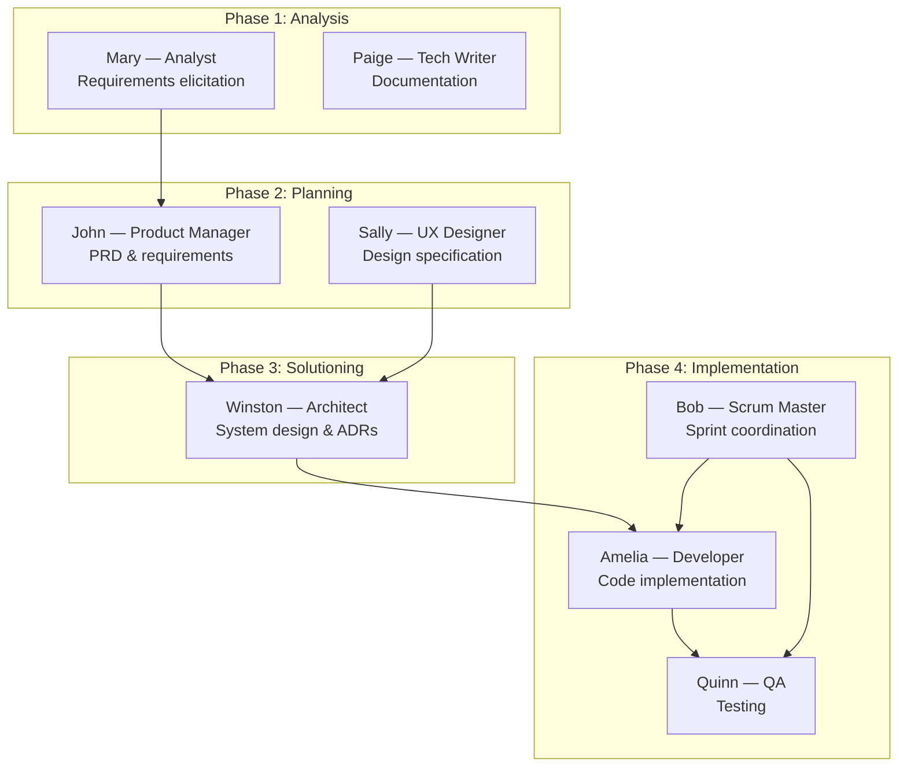
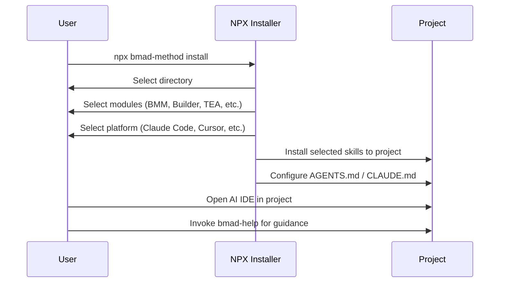

# BMAD Method

**Build More Architect Dreams** -- the most comprehensive agile-inspired AI development framework, modeling an entire software team as a collection of 8 named AI agent personas in the core module (the README claims 12+ including extension modules).

| | |
|:---|:---|
| **Repository** | [github.com/bmad-code-org/BMAD-METHOD](https://github.com/bmad-code-org/BMAD-METHOD) |
| **License** | MIT |
| **Install** | `npx bmad-method install` |
| **Language** | TypeScript + Markdown |
| **Requirements** | Node.js 20+ |
| **Agent Support** | Claude Code, Cursor, and other AI IDEs |

---

## How It Works

BMAD takes the philosophy that AI tools should not just do the thinking for you, but should act as **expert collaborators** who guide you through a structured process. It models a complete agile development team through specialized AI agent personas, each with domain-specific expertise and responsibilities.

### Core Concept: Agent Personas

Unlike frameworks that treat the AI as a single general-purpose assistant, BMAD creates distinct personas -- a Product Manager who thinks in user stories, an Architect who thinks in system design, a Developer who thinks in code, a QA Engineer who thinks in test coverage:



### The Four-Phase Lifecycle

BMAD organizes its skills into four sequential phases, each with specialized workflows:

#### Phase 1: Analysis (`bmm-skills/1-analysis/`) -- 8 skills

- **`bmad-agent-analyst`** (Mary) -- Requirements elicitation and domain analysis
- **`bmad-agent-tech-writer`** (Paige) -- Documentation generation
- **`bmad-document-project`** -- Project documentation
- **`bmad-prfaq`** -- Press Release / FAQ (Amazon-style working backwards)
- **`bmad-product-brief`** -- Product brief creation
- **`research/bmad-domain-research`** -- Domain-specific investigation
- **`research/bmad-market-research`** -- Market analysis
- **`research/bmad-technical-research`** -- Technical feasibility research

#### Phase 2: Plan Workflows (`bmm-skills/2-plan-workflows/`) -- 6 skills

- **`bmad-agent-pm`** (John) -- Product Manager; PRD creation through user interviews
- **`bmad-agent-ux-designer`** (Sally) -- UX design specification
- **`bmad-create-prd`** -- PRD creation workflow
- **`bmad-edit-prd`** -- PRD editing and refinement
- **`bmad-validate-prd`** -- PRD completeness and coherence validation
- **`bmad-create-ux-design`** -- Interactive design creation

#### Phase 3: Solutioning (`bmm-skills/3-solutioning/`) -- 5 skills

- **`bmad-agent-architect`** (Winston) -- Technical design leadership
- **`bmad-create-architecture`** -- ADR-driven architecture documentation
- **`bmad-create-epics-and-stories`** -- Work breakdown structure
- **`bmad-check-implementation-readiness`** -- Alignment verification (PRD / UX / Architecture / Stories)
- **`bmad-generate-project-context`** -- Extracts technical conventions into compact `project-context.md` for all implementation agents

#### Phase 4: Implementation (`bmm-skills/4-implementation/`)

- **`bmad-agent-dev`** -- Developer agent for code implementation
- **`bmad-agent-qa`** -- QA agent for test generation
- **`bmad-agent-sm`** -- Scrum Master for sprint coordination
- **`bmad-create-story`** -- User story creation
- **`bmad-dev-story`** -- Story-based development
- **`bmad-sprint-planning`** -- Sprint planning ceremonies
- **`bmad-sprint-status`** -- Sprint status tracking
- **`bmad-code-review`** -- Code review workflows
- **`bmad-retrospective`** -- Sprint retrospectives
- **`bmad-qa-generate-e2e-tests`** -- End-to-end test generation
- **`bmad-quick-dev`** -- Quick development for small tasks
- **`bmad-correct-course`** -- Mid-sprint course correction
- **`bmad-checkpoint-preview`** -- Preview checkpoints

### Named Agent Personas

Each agent is defined with a complete identity, not just a role:

| Agent | Name | Title | Personality |
|:------|:-----|:------|:------------|
| `bmad-agent-pm` | John | Product Manager | Asks "WHY?" relentlessly; Jobs-to-be-Done framework; ship-smallest-thing mentality |
| `bmad-agent-architect` | Winston | System Architect | Balances vision with pragmatism; prioritizes boring, stable tech |
| `bmad-agent-dev` | Amelia | Developer | Ultra-precise; "100% test pass before done"; no shortcuts |
| `bmad-agent-ux-designer` | Sally | UX Designer | User-centered design specification and interaction flows |
| `bmad-agent-sm` | Bob | Scrum Master | Sprint coordination; retrospective facilitation |
| `bmad-agent-qa` | Quinn | QA Engineer | Test strategy; E2E generation; adversarial testing |
| `bmad-agent-analyst` | Mary | Analyst | Requirements elicitation and domain analysis |
| `bmad-agent-tech-writer` | Paige | Tech Writer | Documentation generation and knowledge extraction |

### Core Skills (`core-skills/`)

In addition to the phased BMM skills, BMAD provides cross-cutting core skills:

| Skill | Purpose |
|:------|:--------|
| `bmad-help` | Intelligent guidance on what to do next |
| `bmad-party-mode` | Multi-agent persona collaboration in one session |
| `bmad-brainstorming` | Structured brainstorming facilitation |
| `bmad-advanced-elicitation` | Deep requirements elicitation |
| `bmad-distillator` | Document distillation and summarization |
| `bmad-editorial-review-prose` | Prose quality review |
| `bmad-editorial-review-structure` | Structure quality review |
| `bmad-review-adversarial-general` | Adversarial review for robustness |
| `bmad-review-edge-case-hunter` | Edge case identification |
| `bmad-shard-doc` | Document sharding for context management |
| `bmad-index-docs` | Documentation indexing |

### Scale-Adaptive Intelligence

A distinguishing feature of BMAD is its **scale-domain-adaptive** design. The framework automatically adjusts planning depth based on project complexity:

- **Bug fix** -- Minimal ceremony, quick dev workflow
- **Small feature** -- Abbreviated analysis and planning
- **Medium project** -- Standard agile flow with sprint planning
- **Enterprise system** -- Full ceremony with all agent personas, comprehensive documentation, formal reviews

### Party Mode

BMAD's unique **Party Mode** (`bmad-party-mode`) spawns multiple agent personas as **independent subagent processes** to collaborate and discuss. Unlike single-LLM roleplay where "opinions" tend to converge, each agent thinks independently, producing genuine diversity of thought. A `--solo` flag falls back to single-LLM roleplay as a degraded mode when subagent spawning is unavailable.

### Module Ecosystem

BMAD extends through official modules:

| Module | Code | Purpose |
|:-------|:-----|:--------|
| **BMAD Method (BMM)** | Core | Core framework with 34+ workflows |
| **BMad Builder (BMB)** | [bmad-builder](https://github.com/bmad-code-org/bmad-builder) | Create custom agents and workflows |
| **Test Architect (TEA)** | [test-architecture-enterprise](https://github.com/bmad-code-org/bmad-method-test-architecture-enterprise) | Risk-based test strategy |
| **Game Dev Studio (GDS)** | [game-dev-studio](https://github.com/bmad-code-org/bmad-module-game-dev-studio) | Game development workflows (Unity, Unreal, Godot) |
| **Creative Intelligence (CIS)** | [creative-intelligence-suite](https://github.com/bmad-code-org/bmad-module-creative-intelligence-suite) | Innovation and design thinking |
| **Whiteport Design Studio (WDS)** | Community module | Design studio workflows |

---

## Architecture & Design

### Repository Structure

```
BMAD-METHOD/
├── src/
│   ├── bmm-skills/              # Phase-organized skills
│   │   ├── 1-analysis/          # Analysis phase (6 skills)
│   │   ├── 2-plan-workflows/    # Planning phase
│   │   ├── 3-solutioning/       # Architecture phase
│   │   └── 4-implementation/    # Development phase (13 skills)
│   └── core-skills/             # Cross-cutting skills (11 skills)
├── tools/
│   ├── installer/               # NPX installer
│   ├── validate-skills.js       # Skill validation
│   ├── skill-validator.md       # Validation rules
│   └── platform-codes.yaml      # Platform configuration
├── test/                        # Test suite
├── docs/                        # Documentation
└── website/                     # Documentation site source
```

### Key Design Decisions

1. **Numbered Phase Directories** -- Skills are organized in numbered directories (`1-analysis/`, `2-plan-workflows/`, etc.) that encode the intended workflow order. This makes the process legible at the filesystem level.

2. **Persona-Per-Skill** -- Each skill file defines a complete agent persona with its domain knowledge, responsibilities, and behavioral patterns. The `bmad-agent-dev` skill creates a different AI personality than `bmad-agent-analyst`.

3. **YAML Module Manifests** -- Each top-level module (`bmm-skills/`, `core-skills/`) has a `module.yaml` and `module-help.csv` for metadata and help integration. Individual skills have `bmad-skill-manifest.yaml` files for agent-specific metadata (displayName, title, icon, identity).

4. **NPX Installer with Module Selection** -- The installer (`tools/installer/`) lets users pick which modules to install and which platform to target, supporting both interactive and CI/CD non-interactive modes.

5. **Skill Validation Pipeline** -- `tools/validate-skills.js` runs deterministic checks on all skills, integrated into the `npm run quality` CI pipeline. This ensures skill content meets structural requirements.

---

## Strengths

{: .tip }
> BMAD is the framework that most closely models how a real software team operates, making it natural for developers who think in agile terms.

1. **Deepest Agile Process Modeling** -- No other framework in this comparison models sprint planning, retrospectives, story creation, and scrum master coordination. If your mental model of development is agile, BMAD speaks your language.

2. **Scale-Adaptive Intelligence** -- The automatic adjustment from bug-fix ceremony to enterprise-grade process means one framework works for all project sizes. You don't need to pick the right tool for the right size.

3. **Party Mode Multi-Agent Collaboration** -- The ability to bring multiple personas into one session for debate and convergence is unique. This simulates the most valuable part of team meetings -- the cross-functional discussion.

4. **Comprehensive Module Ecosystem** -- Game development, test architecture, creative intelligence -- BMAD covers domains that no other framework touches. The module system means the core stays lean while specialized modules add depth.

5. **PRFAQ / Working Backwards** -- The Amazon-style "press release first" workflow forces clarity of vision before any code is written. This is a proven product strategy technique rarely seen in AI coding frameworks.

6. **Quality Pipeline** -- Skill validation is CI-integrated (`npm run validate:skills`). This treats prompt content with the same rigor as code -- a sign of maturity.

7. **Free and Open** -- Explicitly no paywalls, no gated content, no gated Discord. The community commitment is genuine.

---

## Weaknesses

{: .warning }
> BMAD's enterprise-grade process can be overwhelming for solo developers or small projects that just need to ship.

1. **Steepest Learning Curve** -- With 8 named agent personas (more in extension modules), 4 phases, 34+ workflows, and 5 modules, BMAD has the most concepts to learn. New users must understand the persona model, the phase system, and when to invoke which agent.

2. **Agile Ceremony Overhead** -- Sprint planning, retrospectives, and scrum master coordination add overhead that solo developers or small teams may not need. The framework's strength (comprehensive agile modeling) becomes a weakness when ceremony exceeds value.

3. **Agent Persona Switching Friction** -- Unlike frameworks where the AI maintains a single coherent context, BMAD's persona model means context switches between agents. The Architect's understanding may not fully transfer to the Developer's execution.

4. **Broad but Uneven Platform Support** -- The installer supports 22 platforms (including Claude Code, Cursor, Codex, Gemini CLI, Copilot, and more), but only Claude Code and Cursor are marked as "preferred." Other platforms may have less-tested integrations.

5. **Heavy Node.js Dependency** -- Requiring Node.js 20+ for an NPX installer is a heavier dependency than Spec Kit's Python-based CLI or Superpowers' zero-dependency plugin approach.

6. **Module Fragmentation** -- With capabilities spread across 5 separate repos (BMM, Builder, Test Architect, Game Dev, Creative Intelligence), understanding the full ecosystem requires navigating multiple projects.

7. **Enterprise Terminology Barrier** -- Terms like "PRFAQ," "sprint ceremonies," "story points," and "retrospectives" assume familiarity with enterprise agile. Solo developers or non-enterprise users may find this vocabulary alienating rather than helpful.

---

## Technical Details

### Skill Structure

Each BMAD skill is a Markdown file with structured sections:

- **Persona definition** -- Who the agent is and what it knows
- **Responsibilities** -- What the agent does and doesn't do
- **Workflow steps** -- The ordered process the agent follows
- **Checklists** -- Quality gates that must pass before proceeding
- **Templates** -- Output templates for documents the agent produces

### Installation Flow



### Three-Layer Code Review

BMAD's `bmad-code-review` spawns three independent subagent reviewers in parallel:

1. **Blind Hunter** -- Reviews code without knowing intent (finds what stands out)
2. **Edge Case Hunter** -- Exhaustively traces boundary conditions
3. **Acceptance Auditor** -- Validates acceptance criteria are actually satisfied

The adversarial design means reviewers must *find issues*. Zero findings triggers re-analysis. This prevents rubber-stamping.

### Project Context as "Lossless Compression"

`bmad-generate-project-context` solves a key multi-agent problem: how do you tell 10 different agents about your codebase's conventions without making them each read 50,000 lines? It extracts unobvious conventions into a compact `project-context.md`:

```markdown
## Critical Implementation Rules
- Strict mode enabled
- Use interface for public APIs, type for unions
- Components in /src/components/ with co-located .test.tsx
- All async ops use handleError wrapper
- Feature flags via featureFlag() from @/lib/flags
```

Every implementation agent loads this before writing code. No codebase archaeology needed.

### Quality Assurance

BMAD uses a multi-layer quality approach:

1. **Skill Validation** -- `tools/validate-skills.js` checks structural integrity
2. **ESLint + Prettier** -- Code formatting enforcement
3. **GitHub Actions CI** -- `npm run quality` mirrors CI checks locally
4. **Checklist Gates** -- Phase transitions require checklist completion
5. **Adversarial Code Review** -- Three parallel review subagents

---

*See also: [Spec Kit](spec-kit), [Get Shit Done](get-shit-done), [Superpowers](superpowers)*
