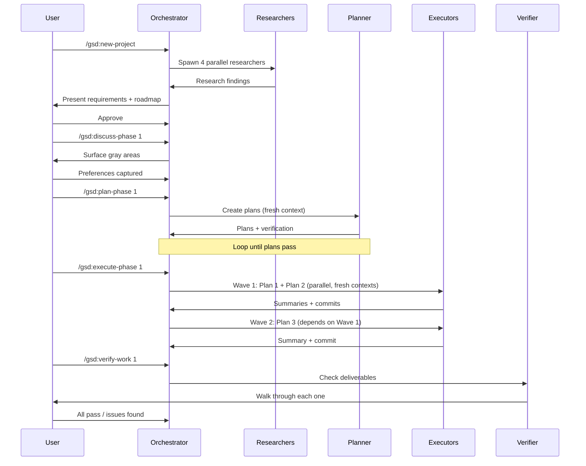

# Get Shit Done (GSD)

**A lightweight meta-prompting, context engineering, and spec-driven development system** -- built for solo developers who want to describe what they want and have it built correctly, without pretending they're running a 50-person engineering org.

| | |
|:---|:---|
| **Repository** | [github.com/gsd-build/get-shit-done](https://github.com/gsd-build/get-shit-done) |
| **License** | MIT |
| **Creator** | TACHES / GSD Foundation |
| **Install** | `npx get-shit-done-cc@latest` |
| **Language** | TypeScript + Markdown |
| **Requirements** | Node.js |
| **Agent Support** | Claude Code, OpenCode, Gemini CLI, Codex, GitHub Copilot, Cursor, Windsurf, Antigravity |

---

## How It Works

GSD's core thesis is that **Claude Code is incredibly powerful *if* you give it the right context**. Most people don't. GSD handles context engineering automatically: it manages what the AI knows, when it knows it, and how much context budget remains. The complexity is in the system, not in your workflow.

### The Core Problem: Context Rot

Context rot is the quality degradation that happens as Claude fills its context window. After 50k tokens of conversation, responses get shorter, less creative, and less accurate. GSD solves this by:

1. **Fresh context per plan** -- Each task plan gets a clean 200k token context window
2. **Size-limited artifacts** -- Every file has limits tuned to where Claude's quality degrades
3. **Orchestrator pattern** -- Thin orchestrators spawn specialized agents, never doing heavy lifting themselves

### The Six-Phase Workflow

```mermaid
graph TD
    A["/gsd:new-project<br/>Questions → Research → Requirements → Roadmap"] --> B["/gsd:discuss-phase N<br/>Surface gray areas, capture preferences"]
    B --> C["/gsd:plan-phase N<br/>Research → Plans → Verify"]
    C --> D["/gsd:execute-phase N<br/>Wave execution with fresh contexts"]
    D --> E["/gsd:verify-work N<br/>Walk through deliverables"]
    E --> F["/gsd:ship N<br/>Create PR from verified work"]
    F --> G{More phases?}
    G -->|Yes| B
    G -->|No| H["/gsd:complete-milestone"]
    H --> I["/gsd:new-milestone<br/>Next version"]

    style A fill:#2d5016,stroke:#4a9e4a
    style D fill:#1a3a5c,stroke:#4a9eda
    style E fill:#4a3a1a,stroke:#e6a817
```



#### Phase 1: Initialize (`/gsd:new-project`)

One command, one flow:
1. **Questions** -- Asks until it understands your idea completely (goals, constraints, tech preferences, edge cases)
2. **Research** -- Spawns 4 parallel researchers to investigate the domain
3. **Requirements** -- Extracts what's v1, v2, and out of scope
4. **Roadmap** -- Creates phases mapped to requirements

**Creates:** `PROJECT.md`, `REQUIREMENTS.md`, `ROADMAP.md`, `STATE.md`, `.planning/research/`

#### Phase 2: Discuss (`/gsd:discuss-phase N`)

Surfaces gray areas based on what's being built:
- **Visual features** -- Layout, density, interactions, empty states
- **APIs/CLIs** -- Response format, flags, error handling
- **Content systems** -- Structure, tone, depth, flow

The deeper you go, the more the system builds what you actually want. Skip it and you get reasonable defaults.

**Creates:** `{N}-CONTEXT.md`

#### Phase 3: Plan (`/gsd:plan-phase N`)

1. **Researches** -- Investigates implementation approaches guided by CONTEXT.md
2. **Plans** -- Creates 2-3 atomic task plans with XML structure
3. **Verifies** -- Checks plans against requirements, loops until they pass

Each plan is small enough to execute in a fresh context window.

**Creates:** `{N}-RESEARCH.md`, `{N}-{M}-PLAN.md`

#### Phase 4: Execute (`/gsd:execute-phase N`)

This is where GSD's context engineering shines:

```
┌─────────────────────────────────────────────────────┐
│  WAVE EXECUTION                                      │
│                                                      │
│  WAVE 1 (parallel)       WAVE 2 (parallel)    WAVE 3 │
│  ┌──────┐ ┌──────┐      ┌──────┐ ┌──────┐    ┌──────┐│
│  │Plan 1│ │Plan 2│  →   │Plan 3│ │Plan 4│  → │Plan 5││
│  │      │ │      │      │      │ │      │    │      ││
│  │ User │ │ Prod │      │ API  │ │ Cart │    │ UI   ││
│  │Model │ │Model │      │      │ │      │    │      ││
│  └──────┘ └──────┘      └──────┘ └──────┘    └──────┘│
│                                                      │
│  Independent → Same wave → Parallel                  │
│  Dependent  → Later wave → Sequential                │
└─────────────────────────────────────────────────────┘
```

- **Fresh 200k context per plan** -- Zero accumulated garbage
- **Parallel where possible** -- Plans grouped into dependency waves
- **Atomic commits per task** -- Every task gets its own commit
- **Verification against goals** -- Checks the codebase delivers what the phase promised

#### Phase 5: Verify (`/gsd:verify-work N`)

1. **Extracts testable deliverables** from the phase goals
2. **Walks you through each one** -- "Can you log in with email?" Yes/no
3. **Diagnoses failures automatically** -- Spawns debug agents
4. **Creates fix plans** -- Ready for immediate re-execution

#### Phase 6: Ship & Repeat

`/gsd:ship N` creates a PR. `/gsd:complete-milestone` archives and tags. `/gsd:new-milestone` starts the next version.

Or just: `/gsd:next` -- auto-detect and run the next step.

### Quick Mode

```
/gsd:quick
```

For ad-hoc tasks that don't need full planning:
- Same agents, same quality
- Skips optional steps (research, plan checker, verifier)
- Composable flags: `--discuss`, `--research`, `--validate`, `--full`
- Lives in `.planning/quick/`, separate tracking

---

## Architecture & Design

### Context Engineering System

The heart of GSD is its context file system:

| File | Purpose | Size Constraint |
|:-----|:--------|:----------------|
| `PROJECT.md` | Project vision, always loaded | Tuned to Claude's quality threshold |
| `REQUIREMENTS.md` | Scoped v1/v2 requirements with phase traceability | Tuned to Claude's quality threshold |
| `ROADMAP.md` | Phases and progress | Tuned to Claude's quality threshold |
| `STATE.md` | Decisions, blockers, session memory | Tuned to Claude's quality threshold |
| `CONTEXT.md` | Discussion decisions per phase | Per-phase |
| `RESEARCH.md` | Ecosystem knowledge per phase | Per-phase |
| `PLAN.md` | Atomic task with XML structure | Small enough for fresh context |
| `SUMMARY.md` | What happened, what changed | Per-plan |
| `todos/` | Captured ideas for later | Persistent |
| `threads/` | Cross-session context threads | Persistent |
| `seeds/` | Forward-looking ideas | Surface at right milestone |

{: .insight }
> Every artifact has size limits based on empirical testing of where Claude's quality degrades. This is the essence of GSD's context engineering -- staying under the degradation threshold at every stage.

### XML Plan Format

Every plan uses structured XML optimized for Claude:

```xml
<task type="auto">
  <name>Create login endpoint</name>
  <files>src/app/api/auth/login/route.ts</files>
  <action>
    Use jose for JWT (not jsonwebtoken - CommonJS issues).
    Validate credentials against users table.
    Return httpOnly cookie on success.
  </action>
  <verify>curl -X POST localhost:3000/api/auth/login returns 200 + Set-Cookie</verify>
  <done>Valid credentials return cookie, invalid return 401</done>
</task>
```

### Multi-Agent Orchestration

Every stage uses the same pattern: a **thin orchestrator** spawns specialized agents, collects results, and routes to the next step.

| Stage | Orchestrator | Specialized Agents |
|:------|:-------------|:-------------------|
| Research | Coordinates, presents findings | 4 parallel researchers (stack, features, architecture, pitfalls) |
| Planning | Validates, manages iteration | Planner creates plans, checker verifies, loops until pass |
| Execution | Groups into waves, tracks progress | Executors implement in parallel, each with fresh 200k context |
| Verification | Presents results, routes next | Verifier checks against goals, debuggers diagnose failures |

### Agent Inventory (21 Agents)

| Agent | Role |
|:------|:-----|
| `gsd-planner` | Creates implementation plans |
| `gsd-plan-checker` | Verifies plans against requirements |
| `gsd-executor` | Implements plans in fresh context |
| `gsd-verifier` | Checks codebase against goals |
| `gsd-debugger` | Diagnoses failures |
| `gsd-phase-researcher` | Investigates phase implementation |
| `gsd-project-researcher` | Researches project domain |
| `gsd-research-synthesizer` | Synthesizes research findings |
| `gsd-advisor-researcher` | Advisory research |
| `gsd-codebase-mapper` | Analyzes existing codebase |
| `gsd-roadmapper` | Creates roadmaps |
| `gsd-assumptions-analyzer` | Analyzes assumptions in discuss mode |
| `gsd-security-auditor` | Security audit |
| `gsd-nyquist-auditor` | Quality audit |
| `gsd-ui-researcher` | UI/UX research |
| `gsd-ui-auditor` | UI quality audit |
| `gsd-ui-checker` | UI implementation check |
| `gsd-doc-writer` | Documentation generation |
| `gsd-doc-verifier` | Documentation verification |
| `gsd-integration-checker` | Integration verification |
| `gsd-user-profiler` | User profiling |

### Repository Structure

```
get-shit-done/
├── commands/
│   └── gsd/                      # 59 slash commands
│       ├── new-project.md
│       ├── discuss-phase.md
│       ├── plan-phase.md
│       ├── execute-phase.md
│       ├── verify-work.md
│       ├── ship.md
│       ├── quick.md
│       ├── next.md
│       └── ... (55+ more)
├── agents/                       # 21 specialized agents
│   ├── gsd-planner.md
│   ├── gsd-executor.md
│   ├── gsd-verifier.md
│   └── ...
├── get-shit-done/
│   ├── workflows/                # Workflow definitions
│   ├── templates/                # 42 artifact templates
│   ├── references/               # Reference material
│   └── bin/                      # CLI utilities
├── hooks/                        # Event hooks
├── sdk/                          # Headless SDK
├── scripts/                      # Build scripts
├── tests/                        # Test suite (vitest)
└── bin/
    └── install.js                # NPX installer
```

### Hook System (5 JavaScript Hooks)

GSD includes runtime hooks that provide operational awareness:

| Hook | Purpose |
|:-----|:--------|
| `gsd-statusline.js` | Displays model, task, directory, context usage in status bar |
| `gsd-context-monitor.js` | Warns when context usage hits 35%/25% remaining |
| `gsd-check-update.js` | Background version check for GSD updates |
| `gsd-prompt-guard.js` | Scans `.planning/` writes for prompt injection patterns |
| `gsd-workflow-guard.js` | Advises against manual edits outside GSD workflow |

### Model Profiles

GSD supports configurable model routing with per-agent granularity:

| Profile | Planner / Debugger | Executor / Roadmapper | Researcher | Verifier / Checker | Mapper |
|:--------|:-------------------|:---------------------|:-----------|:-------------------|:-------|
| `quality` | Opus | Opus | Opus | Sonnet | Sonnet |
| `balanced` (default) | Opus | Sonnet | Sonnet | Sonnet | Haiku |
| `budget` | Sonnet | Sonnet | Haiku | Haiku | Haiku |
| `inherit` | Runtime decides | Runtime decides | Runtime decides | Runtime decides | Runtime decides |

When `model_profile` is `"inherit"`, all agents use the parent session's model -- useful for OpenCode or non-Anthropic providers.

---

## Quality Gates

GSD includes built-in quality gates that catch real problems:

| Gate | What It Catches |
|:-----|:----------------|
| **Schema Drift Detection** | ORM changes that are missing database migrations |
| **Security Enforcement** | Verification anchored to threat models |
| **Scope Reduction Detection** | Planner silently dropping requirements |
| **Plan Verification Loop** | Plans that don't satisfy requirements get regenerated |
| **UAT Walkthrough** | Human verification of each testable deliverable |

---

## Strengths

{: .tip }
> GSD is the framework with the best empirical understanding of Claude's context limits. Every artifact size is tuned to where quality degrades.

1. **Best Context Engineering** -- Fresh 200k context per plan, size-limited artifacts, thin orchestrator pattern. GSD understands and works around Claude's quality degradation curves better than any other framework.

2. **Wave-Based Parallel Execution** -- Plans grouped by dependencies into waves that run in parallel. Independent plans execute concurrently while dependent plans wait. This is the most sophisticated execution model.

3. **Anti-Enterprise Philosophy** -- "No enterprise roleplay." GSD is honest about who it's for: solo developers and small teams who want to ship. The vocabulary is direct and the ceremony is minimal.

4. **59 Commands** -- The most comprehensive command set: `new-project`, `discuss-phase`, `plan-phase`, `execute-phase`, `verify-work`, `ship`, `quick`, `next`, `map-codebase`, `health`, `stats`, `forensics`, `pause-work`, `resume-work`, and many more.

5. **Atomic Git Commits** -- Every task gets its own commit with structured messages (`feat(08-02): add email confirmation flow`). Enables git bisect, independent reverts, and clear AI-generated history.

6. **Built-In UAT** -- `/gsd:verify-work` walks through testable deliverables one by one, diagnoses failures automatically, and creates fix plans. No other framework has this integrated human verification loop.

7. **Quick Mode** -- `/gsd:quick` provides GSD guarantees (atomic commits, state tracking) for ad-hoc tasks without full planning overhead. Composable flags (`--discuss`, `--research`, `--validate`, `--full`) let you dial up ceremony as needed.

8. **Headless SDK** -- `gsd-sdk` enables headless autonomous execution for CI/CD integration. No other framework provides a programmatic SDK.

---

## Weaknesses

{: .warning }
> GSD's context engineering is Claude-centric. The XML plan format and context size tuning are optimized for Anthropic models specifically.

1. **Claude-Centric Design** -- XML prompt formatting, 200k context windows, quality degradation thresholds -- these are tuned specifically for Claude models. While GSD supports 8 runtimes, the context engineering may not transfer perfectly to non-Anthropic models.

2. **Recommends Skip-Permissions Mode** -- GSD's documentation recommends `claude --dangerously-skip-permissions` for "frictionless automation." While understandable for GSD's autonomous workflow, this removes safety guardrails that protect against destructive operations.

3. **No TDD Enforcement** -- Unlike Superpowers' mandatory TDD, GSD doesn't enforce test-driven development. Quality gates focus on verification *after* implementation rather than test-first development.

4. **Large Command Surface** -- 59 commands means a significant learning curve for the command vocabulary. While `/gsd:help` and `/gsd:next` mitigate this, new users must learn which commands to use when.

5. **Opinionated File Structure** -- GSD creates a significant number of planning artifacts (PROJECT.md, REQUIREMENTS.md, ROADMAP.md, STATE.md, CONTEXT.md, RESEARCH.md, PLAN.md, SUMMARY.md, plus directories). Projects accumulate planning debt that must be maintained.

6. **Limited Extension Ecosystem** -- Unlike Spec Kit's 38 community extensions, GSD's extensibility is through its built-in command and agent system. There's no community extension marketplace.

7. **Solo-Developer Bias** -- The anti-enterprise philosophy that makes GSD great for solo developers can be a limitation for teams that actually need sprint ceremonies, story points, and stakeholder reporting.

---

## Configuration & Settings

GSD provides a settings system (`/gsd:settings`) for workflow customization:

- **`workflow.discuss_mode`** -- Switch between interactive questions and assumptions-based analysis
- **Research depth** -- Control how much research happens before planning
- **Plan verification** -- Toggle plan checker in quick mode
- **User profiles** -- `/gsd:profile-user` adapts language and depth to the user

### Discuss Mode: Questions vs Assumptions

| Mode | How It Works |
|:-----|:-------------|
| **Questions** (default) | System asks until you're satisfied, one area at a time |
| **Assumptions** | System reads your code, surfaces what it would do and why, asks you to correct what's wrong |

The assumptions mode is powerful for brownfield projects where the codebase already encodes many decisions.

---

## Context File Lifecycle



---

*See also: [BMAD Method](bmad-method), [Spec Kit](spec-kit), [Superpowers](superpowers)*
