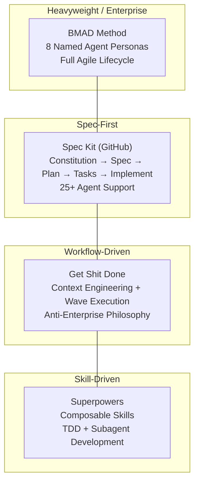
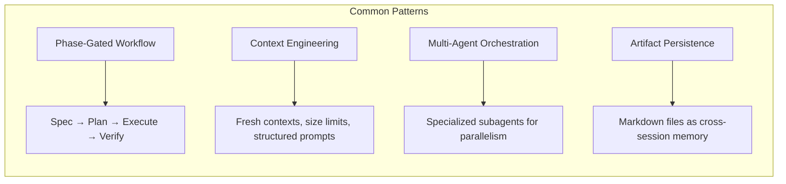

# Agentic Coding Frameworks

As AI coding agents become mainstream, a new class of **agentic coding frameworks** has emerged to solve a fundamental problem: raw AI coding agents are powerful but inconsistent. Without structure, they produce "vibe code" that works for demos but falls apart at scale. These frameworks provide the guardrails, workflows, and context engineering that make AI agents *reliable*.

This section analyzes four leading open-source frameworks, each with a distinct philosophy on how to structure human-AI collaboration for software development.

## The Problem Space

All four frameworks address variants of the same core challenges:

| Challenge | Description |
|:----------|:------------|
| **Context Rot** | Quality degrades as the AI's context window fills with conversation history |
| **Specification Gap** | Users describe what they want imprecisely; AI guesses wrong |
| **Consistency** | AI produces different results for the same request across sessions |
| **Scale** | Approaches that work for a single file break down for multi-file features |
| **Verification** | No way to know if AI output actually meets requirements |
| **Memory Loss** | AI forgets decisions, constraints, and architecture across sessions |

## Framework Overview

### At a Glance

| Dimension | [BMAD Method](bmad-method) | [Spec Kit](spec-kit) | [Get Shit Done](get-shit-done) | [Superpowers](superpowers) |
|:----------|:---------------------------|:---------------------|:-------------------------------|:---------------------------|
| **Creator** | BMad Code Org | GitHub | TACHES / GSD Foundation | Jesse Vincent (Prime Radiant) |
| **Philosophy** | AI agents as expert collaborators in agile workflows | Specifications are executable; "what" before "how" | Context engineering makes AI reliable; no enterprise theater | Composable skills as mandatory workflows, not suggestions |
| **Core Metaphor** | Agile team of 8 named AI agent personas | Spec-driven development pipeline | Meta-prompting + context engineering layer | Software dev workflow built on composable skills |
| **Install** | `npx bmad-method install` | `uv tool install specify-cli` | `npx get-shit-done-cc@latest` | `/plugin install superpowers` |
| **Language** | TypeScript / Markdown | Python CLI + Markdown templates | TypeScript / Markdown | Markdown (pure prompt-based) |
| **Agent Support** | 22 platforms (Claude Code, Cursor preferred) | 25+ agents (most comprehensive) | 8 runtimes (Claude, Gemini, Codex, Copilot, Cursor, Windsurf, Antigravity, OpenCode) | Claude Code, Cursor, Codex, OpenCode, Gemini CLI, Copilot |
| **Extensibility** | Module ecosystem (5 modules) | Extensions + Presets (38 community extensions) | Commands + agents + templates | Plugin architecture (skills, agents, hooks) |
| **Key Strength** | Deepest agile process modeling | Broadest agent support + GitHub backing | Context freshness via wave execution | TDD discipline + subagent autonomy |
| **Complexity** | High (steepest learning curve) | Medium-High (most ceremony) | Medium (complexity hidden behind simple commands) | Low-Medium (auto-triggering skills) |

## Design Philosophy Comparison

### How They Handle the Specification Phase

Each framework takes a fundamentally different approach to turning a vague idea into actionable specifications:

| Framework | Approach | Key Mechanism |
|:----------|:---------|:--------------|
| **BMAD** | Multi-agent analysis with PM, Analyst, and Architect personas that each contribute domain expertise | Scale-adaptive intelligence adjusts depth based on project complexity |
| **Spec Kit** | Constitution-first governance, then explicit spec/plan/task pipeline | Template system with runtime priority resolution |
| **GSD** | Interactive questioning flow with optional parallel research agents | Context files (PROJECT.md, REQUIREMENTS.md, ROADMAP.md) with size limits tuned to Claude's quality thresholds |
| **Superpowers** | Socratic brainstorming skill that teases out intent through conversation | Design presented in digestible chunks for human validation |

### How They Handle Execution

| Framework | Execution Model | Context Strategy |
|:----------|:----------------|:-----------------|
| **BMAD** | Story-based development with sprint ceremonies, dev agent implements per story | Persona context switching; each agent carries its domain knowledge |
| **Spec Kit** | `/speckit.implement` executes all tasks from the plan | Feature-branch isolation; specs as persistent artifacts |
| **GSD** | Wave-based parallel execution; fresh 200k context per plan | Each plan gets a clean subagent context; main window stays under 40% |
| **Superpowers** | Subagent-driven development with two-stage review (spec compliance + code quality) | Fresh subagent per task; mandatory TDD cycle |

### Quality Gates

| Framework | Verification Approach |
|:----------|:---------------------|
| **BMAD** | Checklist-gated phase transitions; QA agent persona; retrospectives |
| **Spec Kit** | `/speckit.analyze` cross-artifact consistency; `/speckit.checklist` quality validation |
| **GSD** | `/gsd:verify-work` walks through testable deliverables with automated diagnosis; schema drift detection; security enforcement; scope reduction detection |
| **Superpowers** | `verification-before-completion` skill; `requesting-code-review` skill; mandatory TDD |

## When to Use Which

{: .insight }
> **Solo developer building a product?** GSD is designed for exactly this -- minimal ceremony, maximum output. Its context engineering solves the quality degradation that kills long AI sessions.

{: .insight }
> **Team that values agile process?** BMAD provides the most comprehensive agile modeling with sprint ceremonies, retrospectives, and specialized agent roles. It's the closest to traditional software engineering practice.

{: .insight }
> **Need maximum agent flexibility?** Spec Kit supports 25+ AI agents and has the richest extension ecosystem. It's also the only framework backed by GitHub.

{: .insight }
> **Want strict engineering discipline?** Superpowers enforces TDD, systematic debugging, and evidence-based verification. Skills trigger automatically -- they're mandatory workflows, not optional suggestions.

| Scenario | Recommended Framework | Why |
|:---------|:---------------------|:----|
| Solo developer, shipping fast | **GSD** | Minimal ceremony, context engineering, anti-enterprise design |
| Enterprise team with agile process | **BMAD** | 8 named agent personas, sprint planning, retrospectives |
| Multi-agent environment (many tools) | **Spec Kit** | 25+ agent support, extensions, GitHub backing |
| Engineering discipline (TDD, reviews) | **Superpowers** | Mandatory TDD, systematic debugging, subagent reviews |
| Existing codebase (brownfield) | **Spec Kit** or **GSD** | Both handle brownfield; GSD has `/gsd:map-codebase`, Spec Kit has brownfield walkthroughs |
| Quick prototyping | **GSD** (`/gsd:quick`) or **Superpowers** | GSD's quick mode; Superpowers auto-triggers |
| Regulated/compliance environment | **Spec Kit** | Constitution system, presets for regulatory standards |

## Architecture Patterns

All four frameworks share some common architectural patterns, though they implement them differently:

| Pattern | BMAD | Spec Kit | GSD | Superpowers |
|:--------|:-----|:---------|:----|:------------|
| Phase gates | Checklist-gated | Command-sequential | Discuss → Plan → Execute → Verify | Skill-triggered |
| Artifact format | Markdown + YAML | Markdown templates | XML-structured plans + Markdown | Markdown with frontmatter |
| Agent dispatch | Persona switching | Single agent with commands | Thin orchestrator + specialized subagents | Subagent-per-task with review |
| Git integration | Git commit per story | Feature branch per spec | Atomic commit per task + wave grouping | Git worktree isolation |

---

*Last updated: April 2026*
