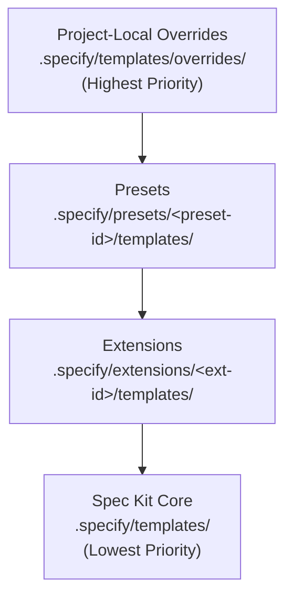
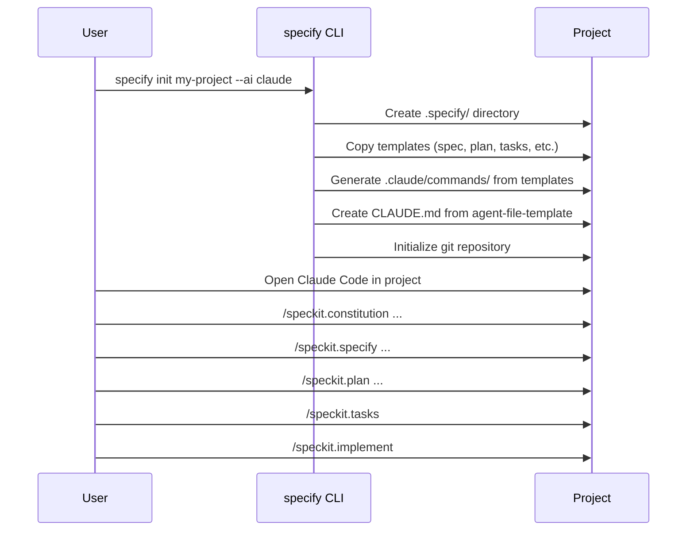

# Spec Kit (GitHub)

**Spec-Driven Development** -- an open-source toolkit from GitHub where specifications become executable, directly generating working implementations rather than just guiding them.

| | |
|:---|:---|
| **Repository** | [github.com/github/spec-kit](https://github.com/github/spec-kit) |
| **License** | MIT |
| **Creator** | GitHub |
| **Install** | `uv tool install specify-cli --from git+https://github.com/github/spec-kit.git` |
| **Language** | Python CLI + Markdown templates |
| **Requirements** | Python 3.11+, uv, Git |
| **Agent Support** | 25+ agents (Claude Code, Gemini CLI, Copilot, Cursor, Codex, Windsurf, Jules, opencode, Qwen, Pi, and many more) |

---

## How It Works

Spec Kit flips the traditional development model: instead of code being king with specs as discardable scaffolding, **specifications become the primary artifact**. The AI agent consumes specs to generate implementations, and specs persist as the authoritative record of intent.

### The Five-Phase Pipeline

```mermaid
graph LR
    A["/speckit.constitution<br/>Governing Principles"] --> B["/speckit.specify<br/>Define What to Build"]
    B --> C["/speckit.plan<br/>Technical Implementation Plan"]
    C --> D["/speckit.tasks<br/>Actionable Task List"]
    D --> E["/speckit.implement<br/>Execute All Tasks"]

    style A fill:#4a3a1a,stroke:#e6a817
    style B fill:#1a3a1a,stroke:#4a9e4a
    style C fill:#1a3a5c,stroke:#4a9eda
    style D fill:#3a1a3a,stroke:#9e4a9e
    style E fill:#3a1a1a,stroke:#9e4a4a
```



#### Step 1: Constitution (`/speckit.constitution`)

Establish your project's **governing principles** -- coding standards, testing requirements, performance targets, UX consistency rules. This creates `.specify/memory/constitution.md`, which the AI references during all subsequent phases. Think of it as the project's "Bill of Rights."

```text
/speckit.constitution Create principles focused on code quality, testing 
standards, user experience consistency, and performance requirements.
```

#### Step 2: Specify (`/speckit.specify`)

Define **what** you want to build and **why**, without specifying the tech stack. Focus on requirements, user stories, and acceptance criteria. This creates the specification artifact.

```text
/speckit.specify Build an application that helps organize photos in albums.
Albums are grouped by date, can be re-organized by drag and drop.
```

{: .insight }
> The deliberate separation of "what" from "how" is central to Spec Kit's philosophy. By deferring technology choices to the planning phase, specifications remain portable and focused on user intent.

#### Step 3: Plan (`/speckit.plan`)

Now provide your tech stack and architecture preferences. The AI creates a technical implementation plan that bridges the specification to concrete code.

```text
/speckit.plan Use Vite with vanilla HTML, CSS, and JavaScript.
Store metadata in a local SQLite database.
```

#### Step 4: Tasks (`/speckit.tasks`)

Break the plan into an actionable task list with dependencies and ordering.

#### Step 5: Implement (`/speckit.implement`)

Execute all tasks and build the feature according to the plan.

### Optional Quality Commands

| Command | When to Use | Purpose |
|:--------|:------------|:--------|
| `/speckit.clarify` | After specify, before plan | Identify and resolve underspecified areas |
| `/speckit.analyze` | After tasks, before implement | Cross-artifact consistency and coverage analysis |
| `/speckit.checklist` | Any time | Generate quality checklists ("unit tests for English") |

---

## Architecture & Design

### Repository Structure

```
spec-kit/
├── src/
│   └── specify_cli/              # Python CLI tool
├── templates/
│   ├── commands/                 # Slash command templates
│   │   ├── constitution.md
│   │   ├── specify.md
│   │   ├── plan.md
│   │   ├── tasks.md
│   │   ├── implement.md
│   │   ├── clarify.md
│   │   ├── analyze.md
│   │   ├── checklist.md
│   │   └── taskstoissues.md
│   ├── agent-file-template.md    # CLAUDE.md / agent instructions
│   ├── spec-template.md          # Specification template
│   ├── plan-template.md          # Plan template
│   ├── tasks-template.md         # Tasks template
│   ├── checklist-template.md     # Checklist template
│   └── constitution-template.md  # Constitution template
├── extensions/                   # Extension system
│   ├── catalog.community.json    # Community extension catalog
│   └── EXTENSION-PUBLISHING-GUIDE.md
├── presets/                      # Preset system
│   ├── catalog.community.json    # Community preset catalog
│   └── PUBLISHING.md
├── tests/                        # Test suite
├── scripts/                      # Build and utility scripts
└── docs/                         # Documentation
```

### Template Resolution Stack

Spec Kit uses a priority-based template resolution system:



Templates are resolved at **runtime** -- Spec Kit walks the stack top-down and uses the first match. This allows deep customization without forking.

### Key Design Decisions

#### 1. Constitution-First Governance

The constitution is the foundational artifact. By establishing principles *before* writing specifications, Spec Kit ensures that all subsequent decisions are governed by explicit, reviewable rules. This is particularly powerful for:
- Teams with compliance requirements
- Projects that need consistent decision-making across features
- Onboarding new team members or AI agents to existing projects

#### 2. Separation of "What" from "How"

The strict separation between `/speckit.specify` (requirements) and `/speckit.plan` (implementation) forces clear thinking about user intent before technology choices. This prevents the common failure of AI coding where tech stack decisions contaminate requirements.

#### 3. Agent-Agnostic Design via `AGENT_CONFIG`

Spec Kit supports 25+ AI agents through a centralized `AGENT_CONFIG` dictionary in the Python CLI that encodes each agent's conventions:
- Directory structure (`.claude/commands/`, `.gemini/commands/`, `.windsurf/workflows/`, etc.)
- File format (Markdown vs TOML)
- Argument passing (`$ARGUMENTS`, `{ARGS}`, agent-specific syntax)
- Command discovery mechanics

The `specify init --ai <agent>` command generates platform-specific files from the same core templates. Adding support for a new agent is a matter of updating one Python dict plus a few docs. This is the most comprehensive multi-agent support of any framework.

#### 4. Extension + Preset Ecosystem

The separation between extensions (add new capabilities) and presets (customize existing workflows) is a clean architectural distinction:
- **Extensions** add new commands and templates
- **Presets** override how existing commands behave
- Multiple presets can be stacked with priority ordering
- Removal of a preset/extension automatically restores the next-highest-priority version

#### 5. Constitutional Gates with Dynamic Verification

The plan template includes a **Constitution Check** gate that must pass before research begins and is re-checked after design:

```markdown
## Constitution Check

*GATE: Must pass before Phase 0 research. Re-check after Phase 1 design.*

[Gates determined based on constitution file]
```

The gates are dynamically generated from the project's `constitution.md` file. For example, if the constitution says "prefer simplicity" and "no premature abstraction," the AI generates corresponding verification checkboxes. If any gate fails, the AI documents justification in a "Complexity Tracking" section. This prevents the common AI failure of over-engineering solutions.

#### 6. Feature-Branch Isolation

Each feature developed with Spec Kit gets its own branch and feature directory (e.g., `001-photo-albums/`). Specs, plans, and tasks persist as artifacts alongside the code, creating a complete audit trail.

---

## Extension Ecosystem

Spec Kit has the richest third-party ecosystem of any framework, with 38 community extensions:

### By Category

| Category | Extensions | Example |
|:---------|:-----------|:--------|
| **Process** | Fleet Orchestrator, Conduct, MAQA, SDD Utilities | Multi-agent workflow orchestration |
| **Code** | Review, Fix Findings, Cleanup, QA Testing | Post-implementation quality gates |
| **Docs** | Archive, Iterate, Retrospective, V-Model | Spec artifact management |
| **Integration** | Jira, Azure DevOps, GitHub Projects, Trello, Linear | External tool sync |
| **Visibility** | Project Health, Project Status | Status reporting |

### Notable Extensions

- **MAQA (Multi-Agent & Quality Assurance)** -- Coordinator + feature + QA agent workflow with parallel worktree-based implementation
- **Superpowers Bridge** -- Integrates Superpowers' skills into the Spec Kit workflow
- **Conduct** -- Orchestrates phases via sub-agent delegation to reduce context pollution
- **DocGuard** -- Canonical-Driven Development enforcement with automated checks

---

## Strengths

{: .tip }
> Spec Kit is the only framework backed by GitHub and with support for 25+ AI agents, making it the safest bet for teams that might switch tools.

1. **Broadest Agent Support** -- 25+ AI agents supported, from Claude Code to Gemini CLI to Copilot to Windsurf to Codex and beyond. No other framework comes close. If you switch AI tools, your specs remain valid.

2. **GitHub Backing** -- Being an official GitHub project provides credibility, maintenance resources, and alignment with the GitHub ecosystem (branches, PRs, issues).

3. **Constitution-First Governance** -- The constitution system is unique among frameworks and crucial for teams with compliance, regulatory, or organizational standards.

4. **Richest Extension Ecosystem** -- 38 community extensions covering process orchestration, code review, documentation, project management integration, and more. This is a sign of real community adoption.

5. **Clean Separation of Concerns** -- The "what" vs "how" split, the extension vs preset distinction, and the template priority stack show thoughtful architectural design.

6. **Feature-Branch Artifact Persistence** -- Specs, plans, and tasks live alongside code in feature branches. This creates a complete audit trail and enables future AI agents to understand why code was written the way it was.

7. **Enterprise-Ready Extensibility** -- Presets for regulatory traceability, Jira integration, Azure DevOps sync, Plan Review Gates -- Spec Kit has the most enterprise integration options.

---

## Weaknesses

{: .warning }
> Spec Kit's ceremony can feel heavy for solo developers. The constitution + specify + plan + tasks + implement pipeline is 5 steps before any code is written.

1. **Most Ceremony Before Code** -- Five mandatory commands before implementation begins. For small features, this is significant overhead. GSD's `/gsd:quick` or Superpowers' auto-triggering skills have much lower ceremony for small tasks.

2. **Python Dependency** -- Requires Python 3.11+ and `uv` for the CLI. While not heavy, it's an additional toolchain compared to NPX-based installers (BMAD, GSD) or zero-dependency plugins (Superpowers).

3. **No Built-In Context Engineering** -- Unlike GSD's explicit context budget management (size limits, fresh contexts per plan), Spec Kit doesn't address context rot directly. Long implementation sessions can still degrade in quality.

4. **Single-Agent Execution** -- The core workflow uses a single agent session. GSD's wave-based parallel execution with fresh subagents is more sophisticated for large implementations.

5. **Extension Quality Variance** -- With 38 community extensions, quality varies. Extensions are "not reviewed, audited, endorsed, or supported" by GitHub. Users must evaluate each extension independently.

6. **No Quick Mode** -- Unlike GSD's `/gsd:quick` for ad-hoc tasks, Spec Kit's pipeline is all-or-nothing. Small fixes still go through the full specify + plan + tasks + implement pipeline.

7. **Spec Drift Risk** -- As implementation proceeds, specs can drift from reality. While the `spec-kit-sync` extension addresses this, it's not built into the core workflow.

---

## Integration Details

### `specify init` Flow



### Feature Directory Layout

```
.specify/
├── memory/
│   └── constitution.md          # Project principles
├── features/
│   └── 001-photo-albums/
│       ├── spec.md              # What to build
│       ├── plan.md              # How to build it
│       ├── tasks.md             # Task breakdown
│       └── checklist.md         # Quality checklist
├── templates/
│   └── overrides/               # Project-local template overrides
├── extensions/                  # Installed extensions
└── presets/                     # Installed presets
```

---

*See also: [BMAD Method](bmad-method), [Get Shit Done](get-shit-done), [Superpowers](superpowers)*
