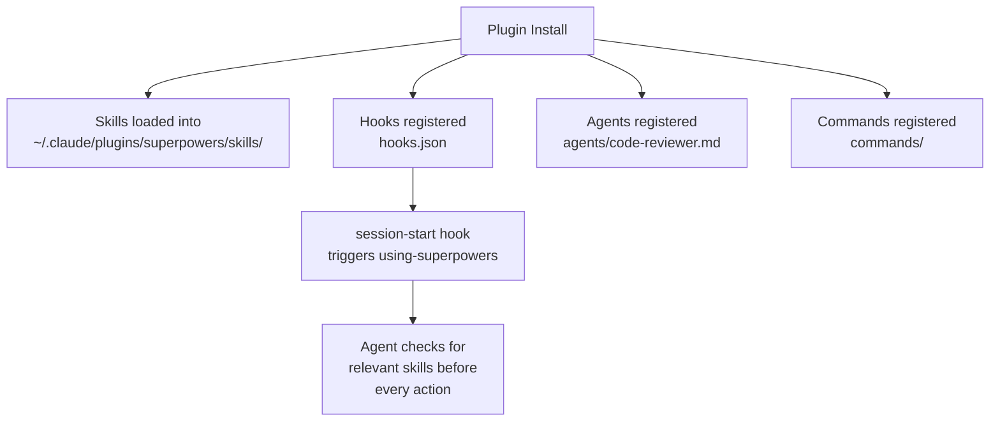

# Superpowers

**A complete software development workflow built on composable skills that trigger automatically** -- turning your AI coding agent from a reactive tool into a disciplined engineering partner.

| | |
|:---|:---|
| **Repository** | [github.com/obra/superpowers](https://github.com/obra/superpowers) |
| **License** | MIT |
| **Creator** | Jesse Vincent (Prime Radiant) |
| **Install** | `/plugin install superpowers` (Claude Code marketplace) |
| **Language** | Pure Markdown (zero-dependency plugin) |
| **Agent Support** | Claude Code, Cursor, Codex, OpenCode, Gemini CLI, GitHub Copilot |

---

## How It Works

Superpowers takes a radically different approach from other frameworks: instead of providing commands you invoke or phases you step through, it installs **skills that trigger automatically based on what you're doing**. When you describe a feature, the brainstorming skill activates before any code is written. When you start implementing, TDD kicks in. When you claim something works, verification fires.

The key insight is that skills are **mandatory workflows, not suggestions**. The agent checks for relevant skills before every task.

### The Basic Workflow

```mermaid
graph TD
    A["User describes a feature"] --> B["brainstorming skill<br/>Socratic design refinement"]
    B --> C["using-git-worktrees<br/>Isolated workspace"]
    C --> D["writing-plans<br/>Bite-sized tasks (2-5 min each)"]
    D --> E["subagent-driven-development<br/>Fresh subagent per task"]
    E --> F["test-driven-development<br/>RED-GREEN-REFACTOR"]
    F --> G["requesting-code-review<br/>Review against plan"]
    G --> H["finishing-a-development-branch<br/>Merge/PR/cleanup"]

    style A fill:#2d5016,stroke:#4a9e4a
    style F fill:#1a3a5c,stroke:#4a9eda
```



1. **Brainstorming** -- Activates before writing code. Refines rough ideas through questions, explores alternatives, presents design in sections for validation. Saves a design document.

2. **Git Worktree Setup** -- Creates an isolated workspace on a new branch, runs project setup, verifies clean test baseline.

3. **Writing Plans** -- Breaks work into bite-sized tasks (2-5 minutes each). Every task has exact file paths, complete code, and verification steps.

4. **Subagent-Driven Development** -- Dispatches a fresh subagent per task with two-stage review:
   - **Stage 1**: Spec compliance -- does the code match the plan?
   - **Stage 2**: Code quality -- is the code well-written?

5. **Test-Driven Development** -- Enforces RED-GREEN-REFACTOR: write failing test, watch it fail, write minimal code, watch it pass, commit. *Deletes code written before tests.*

6. **Code Review** -- Reviews against the plan, reports issues by severity. Critical issues block progress.

7. **Branch Finishing** -- Verifies tests, presents options (merge/PR/keep/discard), cleans up worktree.

### The Skill Library

#### Testing & Verification

| Skill | Purpose |
|:------|:--------|
| `test-driven-development` | RED-GREEN-REFACTOR cycle with anti-patterns reference |
| `systematic-debugging` | 4-phase root cause process (Root Cause Investigation, Pattern Analysis, Hypothesis & Testing, Implementation) |
| `verification-before-completion` | Must run verification *before* claiming anything works |

#### Collaboration & Planning

| Skill | Purpose |
|:------|:--------|
| `brainstorming` | Socratic design refinement through conversation |
| `writing-plans` | Detailed implementation plans with file paths and code |
| `executing-plans` | Batch execution with human checkpoints |
| `dispatching-parallel-agents` | Concurrent subagent workflows for independent tasks |
| `subagent-driven-development` | Fast iteration with two-stage review |

#### Code Review

| Skill | Purpose |
|:------|:--------|
| `requesting-code-review` | Pre-review checklist and submission |
| `receiving-code-review` | How to respond to feedback (verify before blindly implementing) |

#### Git & Workflow

| Skill | Purpose |
|:------|:--------|
| `using-git-worktrees` | Parallel development branches with isolation |
| `finishing-a-development-branch` | Merge/PR decision workflow |

#### Meta

| Skill | Purpose |
|:------|:--------|
| `using-superpowers` | Introduction to the skills system; skill check flow |
| `writing-skills` | Guide for creating new skills |

---

## Architecture & Design

### Repository Structure

```
superpowers/
├── skills/                          # 14 composable skills
│   ├── brainstorming/SKILL.md
│   ├── test-driven-development/SKILL.md
│   ├── systematic-debugging/SKILL.md
│   ├── writing-plans/SKILL.md
│   ├── executing-plans/SKILL.md
│   ├── subagent-driven-development/SKILL.md
│   ├── dispatching-parallel-agents/SKILL.md
│   ├── verification-before-completion/SKILL.md
│   ├── requesting-code-review/SKILL.md
│   ├── receiving-code-review/SKILL.md
│   ├── using-git-worktrees/SKILL.md
│   ├── finishing-a-development-branch/SKILL.md
│   ├── using-superpowers/SKILL.md
│   └── writing-skills/SKILL.md
├── agents/
│   └── code-reviewer.md             # Specialized agent definition
├── hooks/
│   ├── hooks.json                   # Claude Code hook configuration
│   ├── hooks-cursor.json            # Cursor hook configuration
│   └── session-start/               # Session initialization
├── commands/                        # Slash commands
├── CLAUDE.md                        # Contributor guidelines
├── AGENTS.md                        # Agent-facing instructions
├── GEMINI.md                        # Gemini CLI integration
├── docs/                            # Platform-specific docs
└── tests/                           # Test suite
```

### Key Design Decisions

#### 1. Pure Markdown, Zero Dependencies

Every skill is a single `SKILL.md` file. There is no runtime, no build step, no package manager dependency. This is a deliberate philosophical choice: skills are **prompt engineering**, not code. They shape agent behavior through language, not through tooling.

{: .insight }
> "Our internal skill philosophy differs from Anthropic's published guidance on writing skills. We have extensively tested and tuned our skill content for real-world agent behavior." -- from CLAUDE.md

#### 2. Auto-Triggering via `using-superpowers`

The `using-superpowers` skill is the entry point that bootstraps the entire system. It installs as a session-start hook that teaches the agent to check for relevant skills before every action. The key enforcement mechanism is a "Red Flags" table -- a list of rationalizations the agent might use to skip skills:

| Thought | Reality |
|:--------|:--------|
| "This is just a simple question" | Questions are tasks. Check for skills. |
| "I need more context first" | Skill check comes BEFORE clarifying questions. |
| "Let me explore the codebase first" | Skills tell you HOW to explore. Check first. |
| "The skill is overkill" | Simple things become complex. Use it. |

This is a clever prompt engineering technique: by anticipating the AI's avoidance patterns and explicitly countering them, the skill makes compliance the path of least resistance.

#### 3. Skill Priority System

When multiple skills could apply, Superpowers defines an explicit priority:

1. **Process skills first** (brainstorming, debugging) -- determine HOW to approach
2. **Implementation skills second** (frontend-design, etc.) -- guide execution

#### 4. "Human Partner" Terminology

Superpowers consistently uses "your human partner" rather than "the user" throughout its skills. This is deliberate behavior shaping -- it frames the AI as a collaborative partner rather than a tool, encouraging the agent to protect and advocate for the human rather than just executing commands.

#### 5. Two-Stage Review in Subagent Development

The `subagent-driven-development` skill implements a novel review pattern with dedicated prompt templates:
- **Implementer** (`implementer-prompt.md`) -- Fresh subagent per task, zero inherited context
- **Spec Reviewer** (`spec-reviewer-prompt.md`) -- Explicitly told "Do not trust the report" and must inspect actual code
- **Code Quality Reviewer** (`code-quality-reviewer-prompt.md`) -- Checks style, patterns, architecture

By separating these concerns, the review catches both specification drift and code quality issues without conflating them. The "don't trust the report" instruction prevents agents from self-reporting inaccurately.

#### 6. Hard Gates, Not Suggestions

The brainstorming skill contains an explicit `<HARD-GATE>` XML marker that blocks implementation without design approval. The TDD skill enforces its own gate through prose: "NO PRODUCTION CODE WITHOUT A FAILING TEST FIRST" with "Write code before the test? Delete it. Start over." These are non-negotiable barriers, though the enforcement mechanism varies per skill (XML tags in brainstorming, strong prose directives elsewhere).

---

## Integration Model

### Plugin Architecture

Superpowers uses Claude Code's plugin system:



### Multi-Platform Support

| Platform | Install Method | Notes |
|:---------|:---------------|:------|
| Claude Code (Official) | `/plugin install superpowers@claude-plugins-official` | Primary target |
| Claude Code (Marketplace) | `/plugin marketplace add obra/superpowers-marketplace` then `/plugin install superpowers@superpowers-marketplace` | Two-step: register marketplace, then install |
| Cursor | `/add-plugin superpowers` | Plugin marketplace |
| Codex | Tell agent to fetch `.codex/INSTALL.md` from GitHub | Manual setup |
| OpenCode | Tell agent to fetch `.opencode/INSTALL.md` from GitHub | Manual setup |
| Gemini CLI | `gemini extensions install https://github.com/obra/superpowers` | Extension model |
| GitHub Copilot CLI | `copilot plugin marketplace add obra/superpowers-marketplace` then `copilot plugin install superpowers@superpowers-marketplace` | Two-step install |

---

## Strengths

{: .tip }
> Superpowers is the framework that most aggressively enforces engineering discipline. TDD is not optional -- code written before tests gets deleted.

1. **Mandatory Skill Triggering** -- Skills aren't suggestions you might forget. The `using-superpowers` meta-skill ensures the agent checks for relevant skills before every action. The Red Flags table anticipates and counters avoidance patterns.

2. **True TDD Enforcement** -- The `test-driven-development` skill doesn't just suggest TDD -- it enforces RED-GREEN-REFACTOR and *deletes code written before tests*. This is the strongest TDD discipline of any framework.

3. **Two-Stage Subagent Review** -- Separating spec compliance from code quality in the review process catches both specification drift and quality issues. No other framework has this dual-review pattern.

4. **Zero Dependencies** -- Pure Markdown skills mean no build system, no package manager, no runtime dependency. This is the simplest installation model and the lowest maintenance burden.

5. **Context Isolation via Subagents** -- Each task gets a fresh subagent, preventing context rot. The parent agent stays clean and fast while work happens in isolated contexts.

6. **Anti-Rationalization Prompt Engineering** -- The Red Flags tables in skills like `using-superpowers` are a novel prompt engineering technique that's been tested and tuned for real-world agent behavior.

7. **Systematic Debugging** -- The 4-phase debugging skill (Root Cause Investigation, Pattern Analysis, Hypothesis & Testing, Implementation) brings engineering rigor to a process most frameworks leave to ad-hoc reasoning. Supporting technique documents cover root-cause-tracing, defense-in-depth, and condition-based-waiting.

---

## Weaknesses

{: .warning }
> Superpowers' rigid skill enforcement can feel heavy-handed for experienced developers who know when to skip ceremony.

1. **Claude Code Bias** -- While multi-platform support exists, Superpowers is primarily designed for and tested with Claude Code. Other platforms get adapted integration that may not trigger skills as reliably.

2. **Rigid TDD Enforcement** -- The "delete code written before tests" policy is intentionally extreme. For prototyping, exploratory coding, or domains where TDD is difficult (UI, data science), this rigidity can be counterproductive.

3. **No Spec/Planning Phase Depth** -- Compared to Spec Kit's constitution + specify + plan pipeline or GSD's discuss + research + plan sequence, Superpowers' brainstorming skill is the only pre-implementation step. Complex projects may need more structured specification.

4. **No Context Engineering for Long Sessions** -- GSD specifically solves context rot with fresh 200k contexts per plan and size-limited artifacts. Superpowers relies on subagents for context freshness but doesn't have explicit context budget management.

5. **No Built-In Project Management** -- No roadmap, no milestones, no release management. Superpowers handles the development workflow but not the project management wrapper that BMAD and GSD provide.

6. **Highly Opinionated CLAUDE.md** -- The contributor guidelines are extremely strict (94% PR rejection rate claimed). While this maintains quality, it limits community contribution and evolution.

7. **Limited Extensibility Model** -- Unlike Spec Kit's extension + preset ecosystem or BMAD's module system, Superpowers' extension point is "write a new skill." There's no plugin-of-plugin architecture for customization.

---

## Philosophy Deep-Dive

Superpowers embodies four principles that permeate every skill:

### Test-Driven Development
Write tests first, always. Not because it's a best practice, but because it prevents the most common AI coding failure: code that appears to work but doesn't.

### Systematic over Ad-Hoc
Process over guessing. When a bug appears, don't guess at fixes -- follow the 4-phase debugging process. When implementing, don't just start coding -- follow the plan.

### Complexity Reduction
Simplicity as primary goal. The framework itself is simple (14 skills, pure Markdown), and it pushes the agent toward simple solutions.

### Evidence over Claims
Verify before declaring success. The `verification-before-completion` skill requires running verification commands and confirming output before making any success claims. "Evidence before assertions, always."

---

*See also: [BMAD Method](bmad-method), [Spec Kit](spec-kit), [Get Shit Done](get-shit-done)*
