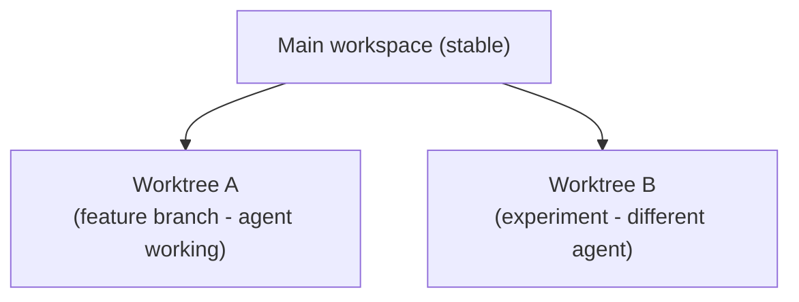
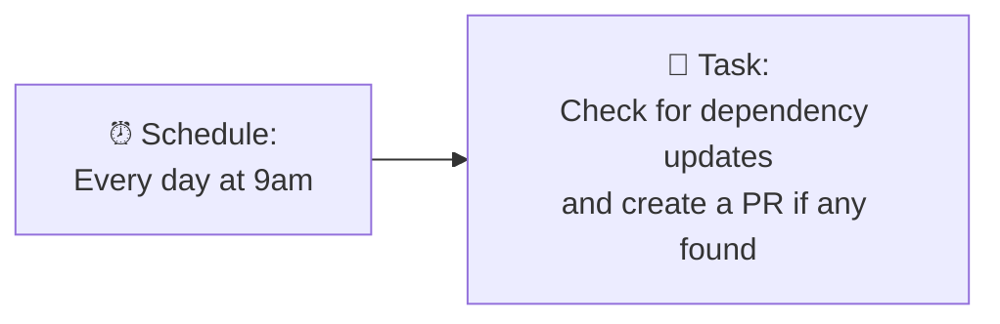
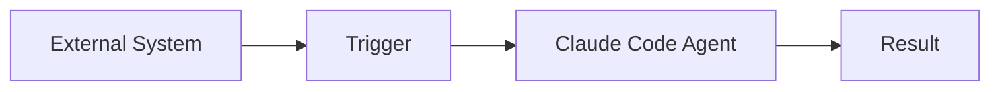
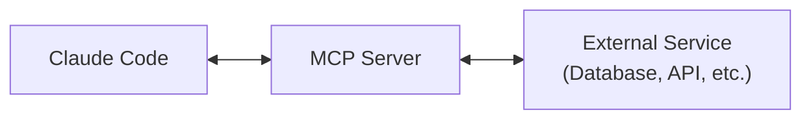
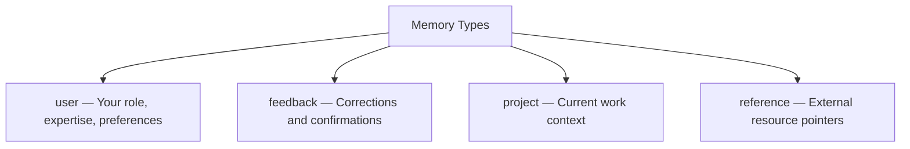
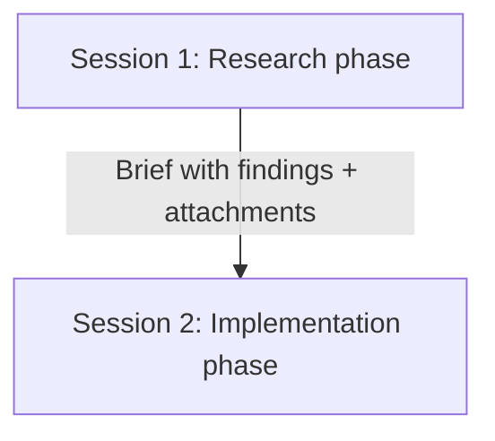
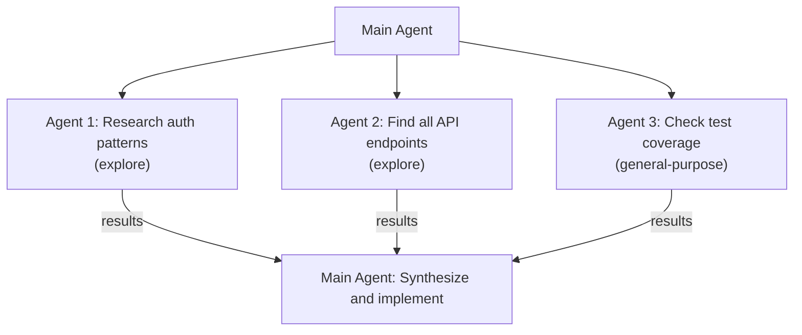

# Advanced Workflows

Understanding Claude Code's internals enables workflows that go beyond basic "ask and receive" interactions.

## 1. Worktree-Isolated Development

Claude Code supports git worktrees natively through `EnterWorktreeTool` and `ExitWorktreeTool`. This enables:

**How to use it:**
- Ask Claude Code to work in an isolated worktree for risky changes
- Sub-agents can be spawned with `isolation: "worktree"` to work on separate branches
- If the changes work, merge back; if not, discard the worktree cleanly

**Source:** `tools/EnterWorktreeTool/`, `tools/ExitWorktreeTool/`

---

## 2. Plan Mode for Architecture

The `EnterPlanModeTool` switches Claude Code into a planning mode where:
- Code modifications are disabled
- The model focuses on architecture and design
- Plans are structured and reviewable
- You approve the plan before any code is written

**Best for:**
- Large feature design
- Refactoring strategy
- Understanding existing architecture before changes

**Source:** `tools/EnterPlanModeTool/`, `tools/ExitPlanModeTool/`

---

## 3. Cron-Scheduled Agents

The `ScheduleCronTool` (with CronCreate, CronDelete, CronList) enables scheduled autonomous operations:

**Use cases:**
- Automated dependency updates
- Daily code quality checks
- Scheduled documentation generation
- Regular test suite execution

**Source:** `tools/ScheduleCronTool/`

---

## 4. Remote Agent Triggers

The `RemoteTriggerTool` enables triggering Claude Code agents remotely:

**Use cases:**
- CI/CD integration (trigger on PR creation)
- Webhook-driven automation
- Cross-system orchestration

**Source:** `tools/RemoteTriggerTool/`

---

## 5. LSP-Powered Code Intelligence

The `LSPTool` integrates Language Server Protocol, giving Claude Code:
- Go-to-definition
- Find references
- Symbol search
- Type information
- Code diagnostics

**How to leverage it:**
- Ask Claude Code about type relationships
- Request "find all usages of function X"
- LSP provides more accurate results than grep for code navigation

**Source:** `tools/LSPTool/`, `symbolContext.ts`

---

## 6. MCP Server Integration

Claude Code can connect to MCP servers for extended capabilities:

**Key modules:**
- `MCPTool` - Execute MCP tools
- `McpAuthTool` - Authenticate with MCP servers
- `ListMcpResourcesTool` - Discover available resources
- `ReadMcpResourceTool` - Read MCP-provided resources

**Source:** `tools/MCPTool/`, `tools/McpAuthTool/`, `skills/mcpSkillBuilders.ts`

---

## 7. Memory-Driven Personalization

Use the memory system strategically:

**Advanced memory techniques:**
- Store team conventions as feedback memories
- Use project memories for sprint context
- Reference memories for linking to external docs, dashboards, tickets
- The `remember` skill (`skills/bundled/remember.ts`) provides a structured way to save memories

**Source:** `memdir/`, `skills/bundled/remember.ts`

---

## 8. Multi-Session Handoffs with Briefs

The `BriefTool` creates structured handoff documents:

**What briefs include:**
- Context summary
- File attachments
- Decision log
- Next steps

**Source:** `tools/BriefTool/`, `attachments.ts`, `upload.ts`

---

## 9. Parallel Sub-Agent Execution

Launch multiple sub-agents simultaneously for independent tasks:

**Source:** `tools/AgentTool/forkSubagent.ts`, `runAgent.ts`

---

## 10. Custom Hooks for Automation

The hook system (104 modules) enables event-driven automation:

| Event | Use Case |
|:------|:---------|
| `PreToolUse` | Validate before tool execution |
| `PostToolUse` | React to tool results |
| `Stop` | Actions when conversation ends |

**Example hooks:**
- Auto-format code after every file write
- Run linter after every edit
- Block certain commands in production directories
- Send notifications on task completion

**Source:** `hooks/`, `schemas/hooks.ts`
