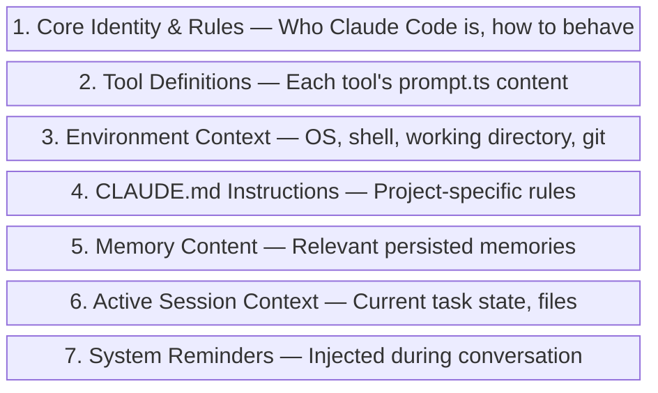

# Prompt Engineering Techniques

Claude Code's system prompt is a masterclass in production prompt engineering. It's not a single document but a dynamically assembled, multi-section prompt that adapts to context. Understanding these techniques helps you write better CLAUDE.md files and structure your interactions more effectively.

## System Prompt Architecture

The system prompt is assembled from `constants/systemPromptSections.ts` and includes:



## Key Prompt Techniques Used

### 1. Behavioral Anchoring
The system prompt uses strong behavioral anchoring - explicit statements about what to do AND what not to do:

> "Don't add features, refactor code, or make 'improvements' beyond what was asked."

> "Three similar lines of code is better than a premature abstraction."

These aren't generic guidelines - they're specific anti-patterns learned from real user frustration.

### 2. Structured Tool Instructions
Each tool's `prompt.ts` contains:
- **When to use** the tool (positive triggers)
- **When NOT to use** the tool (negative triggers)
- **Parameter documentation** with examples
- **Common mistakes** to avoid

### 3. Environment Injection
The prompt dynamically includes:
```
- Platform: win32/darwin/linux
- Shell: bash/zsh/powershell
- Working directory path
- Git repository status
- Model name and capabilities
- Current date
```

### 4. Priority Hierarchy
Instructions follow an explicit priority order:
1. User's explicit instructions (CLAUDE.md, direct requests)
2. Plugin/skill instructions
3. Default system prompt

### 5. Anti-Pattern Documentation
The system prompt explicitly lists "red flag" thoughts to catch:

| Thought | Correction |
|:--------|:-----------|
| "Let me add error handling" | Only validate at system boundaries |
| "Let me refactor this" | Don't improve beyond what was asked |
| "Let me add a helper" | Don't abstract one-time operations |
| "Let me add comments" | Only where logic isn't self-evident |

{: .insight }
> The system prompt treats the model as a smart but sometimes overeager engineer. Many instructions are specifically about restraint - doing less, not more. This is a deliberate design choice based on user feedback.

## Constants That Shape Behavior

The `constants/` directory (21 modules) contains carefully tuned values:

| Module | Purpose |
|:-------|:--------|
| `apiLimits.ts` | Token limits, rate limits |
| `toolLimits.ts` | Per-tool resource limits |
| `prompts.ts` | Prompt template strings |
| `systemPromptSections.ts` | System prompt section definitions |
| `outputStyles.ts` | Output formatting rules |
| `spinnerVerbs.ts` | Loading indicator text |
| `turnCompletionVerbs.ts` | Turn completion messages |
| `xml.ts` | XML tag definitions for structured sections |
| `figures.ts` | ASCII art and diagrams |
| `messages.ts` | User-facing messages |
