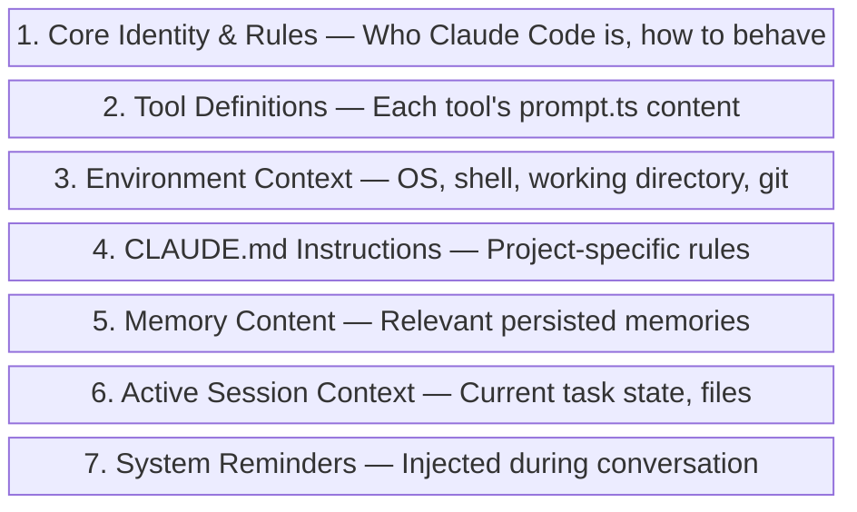

# Prompt Engineering Techniques

Claude Code's system prompt is a masterclass in production prompt engineering. It's not a single document but a dynamically assembled, multi-section prompt that adapts to context. Understanding these techniques helps you write better CLAUDE.md files and structure your interactions more effectively.

## System Prompt Architecture

The system prompt is assembled from `constants/systemPromptSections.ts` and includes:



### Source Code: How the System Prompt is Built

The system prompt is constructed in [`constants/prompts.ts`](../../source_code/original_src/constants/prompts.ts) via the `getSystemPrompt()` function. It returns a `string[]` — an array of prompt sections that are concatenated. The assembly follows a strict static/dynamic split with an explicit cache boundary marker.

#### The Main Assembly Function

From `constants/prompts.ts:444`:

```typescript
export async function getSystemPrompt(
  tools: Tools,
  model: string,
  additionalWorkingDirectories?: string[],
  mcpClients?: MCPServerConnection[],
): Promise<string[]> {
  // ...
  return [
    // --- Static content (cacheable) ---
    getSimpleIntroSection(outputStyleConfig),
    getSimpleSystemSection(),
    outputStyleConfig === null ||
    outputStyleConfig.keepCodingInstructions === true
      ? getSimpleDoingTasksSection()
      : null,
    getActionsSection(),
    getUsingYourToolsSection(enabledTools),
    getSimpleToneAndStyleSection(),
    getOutputEfficiencySection(),
    // === BOUNDARY MARKER - DO NOT MOVE OR REMOVE ===
    ...(shouldUseGlobalCacheScope() ? [SYSTEM_PROMPT_DYNAMIC_BOUNDARY] : []),
    // --- Dynamic content (registry-managed) ---
    ...resolvedDynamicSections,
  ].filter(s => s !== null)
}
```

The `SYSTEM_PROMPT_DYNAMIC_BOUNDARY` constant (`'__SYSTEM_PROMPT_DYNAMIC_BOUNDARY__'`) separates cacheable from per-turn content. Everything before it uses `scope: 'global'` caching; everything after is rebuilt each turn.

#### Section Caching Mechanism

From `constants/systemPromptSections.ts`:

```typescript
/**
 * Create a memoized system prompt section.
 * Computed once, cached until /clear or /compact.
 */
export function systemPromptSection(
  name: string,
  compute: ComputeFn,
): SystemPromptSection {
  return { name, compute, cacheBreak: false }
}

/**
 * Create a volatile system prompt section that recomputes every turn.
 * This WILL break the prompt cache when the value changes.
 * Requires a reason explaining why cache-breaking is necessary.
 */
export function DANGEROUS_uncachedSystemPromptSection(
  name: string,
  compute: ComputeFn,
  _reason: string,
): SystemPromptSection {
  return { name, compute, cacheBreak: true }
}
```

Dynamic sections are registered with explicit names and computed lazily. The `DANGEROUS_` prefix is intentional — cache-breaking sections are marked as dangerous because they increase API costs:

```typescript
DANGEROUS_uncachedSystemPromptSection(
  'mcp_instructions',
  () => isMcpInstructionsDeltaEnabled()
    ? null
    : getMcpInstructionsSection(mcpClients),
  'MCP servers connect/disconnect between turns',
),
```

### Actual System Prompt Sections (from Source)

The following are the actual prompt section functions from [`constants/prompts.ts`](../../source_code/original_src/constants/prompts.ts), showing both the code and the output they produce.

#### 1. Core Identity (`getSimpleIntroSection`)

From `prompts.ts:175`, with the prefix defined in [`constants/system.ts:10`](../../source_code/original_src/constants/system.ts):

```typescript
// system.ts
const DEFAULT_PREFIX = `You are Claude Code, Anthropic's official CLI for Claude.`
const AGENT_SDK_CLAUDE_CODE_PRESET_PREFIX =
  `You are Claude Code, Anthropic's official CLI for Claude, running within the Claude Agent SDK.`
const AGENT_SDK_PREFIX =
  `You are a Claude agent, built on Anthropic's Claude Agent SDK.`
```

The prefix changes based on context — interactive CLI vs Agent SDK vs non-interactive:

```typescript
export function getCLISyspromptPrefix(options?: {
  isNonInteractive: boolean
  hasAppendSystemPrompt: boolean
}): CLISyspromptPrefix {
  if (options?.isNonInteractive) {
    if (options.hasAppendSystemPrompt) {
      return AGENT_SDK_CLAUDE_CODE_PRESET_PREFIX
    }
    return AGENT_SDK_PREFIX
  }
  return DEFAULT_PREFIX
}
```

#### 2. Security Boundary (`CYBER_RISK_INSTRUCTION`)

From [`constants/cyberRiskInstruction.ts`](../../source_code/original_src/constants/cyberRiskInstruction.ts), owned by Anthropic's Safeguards team:

```typescript
/**
 * IMPORTANT: DO NOT MODIFY THIS INSTRUCTION WITHOUT SAFEGUARDS TEAM REVIEW
 *
 * If you need to modify this instruction:
 *   1. Contact the Safeguards team (David Forsythe, Kyla Guru)
 *   2. Ensure proper evaluation of the changes
 *   3. Get explicit approval before merging
 */
export const CYBER_RISK_INSTRUCTION = `IMPORTANT: Assist with authorized security
testing, defensive security, CTF challenges, and educational contexts. Refuse
requests for destructive techniques, DoS attacks, mass targeting, supply chain
compromise, or detection evasion for malicious purposes. Dual-use security tools
(C2 frameworks, credential testing, exploit development) require clear
authorization context: pentesting engagements, CTF competitions, security
research, or defensive use cases.`
```

#### 3. "Doing Tasks" (`getSimpleDoingTasksSection`)

From `prompts.ts:199`. The anti-over-engineering rules are defined as `codeStyleSubitems`:

```typescript
const codeStyleSubitems = [
  `Don't add features, refactor code, or make "improvements" beyond what was
   asked. A bug fix doesn't need surrounding code cleaned up. A simple feature
   doesn't need extra configurability. Don't add docstrings, comments, or type
   annotations to code you didn't change. Only add comments where the logic
   isn't self-evident.`,
  `Don't add error handling, fallbacks, or validation for scenarios that can't
   happen. Trust internal code and framework guarantees. Only validate at system
   boundaries (user input, external APIs).`,
  `Don't create helpers, utilities, or abstractions for one-time operations.
   Don't design for hypothetical future requirements. Three similar lines of
   code is better than a premature abstraction.`,
  // Ant-only items gated on process.env.USER_TYPE === 'ant':
  // - Comment-writing discipline (no-comments-by-default)
  // - Verification before completion
]
```

Note the conditional ant-only rules — Anthropic internal users get stricter comment discipline and a "verify before reporting complete" rule:

```typescript
// @[MODEL LAUNCH]: capy v8 thoroughness counterweight
...(process.env.USER_TYPE === 'ant'
  ? [`Before reporting a task complete, verify it actually works: run the test,
     execute the script, check the output. Minimum complexity means no
     gold-plating, not skipping the finish line.`]
  : []),
```

#### 4. "Using Your Tools" (`getUsingYourToolsSection`)

From `prompts.ts:269`. Tool names are imported constants, not hardcoded strings:

```typescript
const providedToolSubitems = [
  `To read files use ${FILE_READ_TOOL_NAME} instead of cat, head, tail, or sed`,
  `To edit files use ${FILE_EDIT_TOOL_NAME} instead of sed or awk`,
  `To create files use ${FILE_WRITE_TOOL_NAME} instead of cat with heredoc or echo redirection`,
  // Glob/Grep guidance is conditionally skipped when embedded search tools are active:
  ...(embedded ? [] : [
    `To search for files use ${GLOB_TOOL_NAME} instead of find or ls`,
    `To search the content of files, use ${GREP_TOOL_NAME} instead of grep or rg`,
  ]),
]
```

When REPL mode is enabled, most of these rules are dropped because Read/Write/Edit/Glob/Grep/Bash are hidden from direct use.

#### 5. "Executing Actions with Care" (`getActionsSection`)

From `prompts.ts:255`. This is a single large string literal — not assembled from subitems — because it reads as a coherent safety essay:

```typescript
function getActionsSection(): string {
  return `# Executing actions with care

Carefully consider the reversibility and blast radius of actions. Generally you
can freely take local, reversible actions like editing files or running tests.
But for actions that are hard to reverse, affect shared systems beyond your
local environment, or could otherwise be risky or destructive, check with the
user before proceeding.
...
Follow both the spirit and letter of these instructions - measure twice, cut once.`
}
```

#### 6. "Output Efficiency" (`getOutputEfficiencySection`)

From `prompts.ts:403`. This section has two completely different versions — one for external users, one for Anthropic internal:

```typescript
function getOutputEfficiencySection(): string {
  if (process.env.USER_TYPE === 'ant') {
    return `# Communicating with the user
When sending user-facing text, you're writing for a person, not logging to a
console. Assume users can't see most tool calls or thinking - only your text
output. Before your first tool call, briefly state what you're about to do...`
  }
  return `# Output efficiency

IMPORTANT: Go straight to the point. Try the simplest approach first without
going in circles. Do not overdo it. Be extra concise.
...
If you can say it in one sentence, don't use three.`
}
```

The ant-internal version is significantly longer and more nuanced — it emphasizes prose quality and reader comprehension over raw brevity.

#### 7. Environment Info (`computeSimpleEnvInfo`)

From `prompts.ts:651`. This is a dynamic section rebuilt every turn:

```typescript
export async function computeSimpleEnvInfo(
  modelId: string,
  additionalWorkingDirectories?: string[],
): Promise<string> {
  const [isGit, unameSR] = await Promise.all([getIsGit(), getUnameSR()])
  // ...
  const envItems = [
    `Primary working directory: ${cwd}`,
    isWorktree ? `This is a git worktree — an isolated copy...` : null,
    [`Is a git repository: ${isGit}`],
    `Platform: ${env.platform}`,
    getShellInfoLine(),  // e.g. "Shell: bash (use Unix shell syntax...)"
    `OS Version: ${unameSR}`,
    modelDescription,    // "You are powered by the model named Claude Opus 4.6..."
    knowledgeCutoffMessage,
    `The most recent Claude model family is Claude 4.5/4.6. Model IDs — ...`,
    `Claude Code is available as a CLI in the terminal, desktop app...`,
    `Fast mode for Claude Code uses the same ${FRONTIER_MODEL_NAME} model...`,
  ].filter(item => item !== null)
}
```

Note the "undercover" mode — when Claude Code operates in public repositories, all model names and IDs are stripped from the prompt:

```typescript
// Undercover: keep ALL model names/IDs out of the system prompt so nothing
// internal can leak into public commits/PRs.
if (process.env.USER_TYPE === 'ant' && isUndercover()) {
  // suppress
}
```

#### 8. Subagent Default Prompt

From `prompts.ts:758`:

```typescript
export const DEFAULT_AGENT_PROMPT = `You are an agent for Claude Code,
Anthropic's official CLI for Claude. Given the user's message, you should use
the tools available to complete the task. Complete the task fully—don't
gold-plate, but don't leave it half-done. When you complete the task, respond
with a concise report covering what was done and any key findings — the caller
will relay this to the user, so it only needs the essentials.`
```

#### 9. Autonomous/Proactive Mode (`getProactiveSection`)

From `prompts.ts:860`. When proactive mode is active, the entire prompt personality changes:

```typescript
return `# Autonomous work

You are running autonomously. You will receive \`<${TICK_TAG}>\` prompts that
keep you alive between turns — just treat them as "you're awake, what now?"

## Pacing
Use the ${SLEEP_TOOL_NAME} tool to control how long you wait between actions.
**If you have nothing useful to do on a tick, you MUST call ${SLEEP_TOOL_NAME}.**

## Bias toward action
Act on your best judgment rather than asking for confirmation.
- Read files, search code, explore the project, run tests — all without asking.
- Make code changes. Commit when you reach a good stopping point.
- If you're unsure between two reasonable approaches, pick one and go.`
```

### Static vs. Dynamic Split

The system prompt is split into two parts with an explicit cache boundary marker (`SYSTEM_PROMPT_DYNAMIC_BOUNDARY`):

| Part | Sections (from `getSystemPrompt()`) | Cache Behavior |
|:-----|:--------|:---------------|
| **Static** | `getSimpleIntroSection`, `getSimpleSystemSection`, `getSimpleDoingTasksSection`, `getActionsSection`, `getUsingYourToolsSection`, `getSimpleToneAndStyleSection`, `getOutputEfficiencySection` | Cached with `scope: 'global'` via Blake2b hash |
| **Dynamic** | `session_guidance`, `memory`, `env_info_simple`, `language`, `output_style`, `mcp_instructions`, `scratchpad`, `frc`, `summarize_tool_results` | Registry-managed, recomputed via `resolveSystemPromptSections()` |

From the source comment at `prompts.ts:106`:

```typescript
/**
 * Boundary marker separating static (cross-org cacheable) content from dynamic content.
 * Everything BEFORE this marker in the system prompt array can use scope: 'global'.
 * Everything AFTER contains user/session-specific content and should not be cached.
 *
 * WARNING: Do not remove or reorder this marker without updating cache logic in:
 * - src/utils/api.ts (splitSysPromptPrefix)
 * - src/services/api/claude.ts (buildSystemPromptBlocks)
 */
export const SYSTEM_PROMPT_DYNAMIC_BOUNDARY =
  '__SYSTEM_PROMPT_DYNAMIC_BOUNDARY__'
```

This is a cost optimization — the static prefix is cached by the API and shared across all users. The dynamic sections are rebuilt per turn but individually memoized via `systemPromptSection()` until `/clear` or `/compact` resets the cache.

## Key Prompt Techniques Used

### 1. Behavioral Anchoring
The system prompt uses strong behavioral anchoring - explicit statements about what to do AND what not to do:

> "Don't add features, refactor code, or make 'improvements' beyond what was asked."

> "Three similar lines of code is better than a premature abstraction."

These aren't generic guidelines - they're specific anti-patterns learned from real user frustration.

### 2. Structured Tool Instructions
Each tool's `prompt.ts` contains:
- **When to use** the tool (positive triggers)
- **When NOT to use** the tool (negative triggers)
- **Parameter documentation** with examples
- **Common mistakes** to avoid

### 3. Environment Injection
The prompt dynamically includes:
```
- Platform: win32/darwin/linux
- Shell: bash/zsh/powershell
- Working directory path
- Git repository status
- Model name and capabilities
- Current date
```

### 4. Priority Hierarchy
Instructions follow an explicit priority order:
1. User's explicit instructions (CLAUDE.md, direct requests)
2. Plugin/skill instructions
3. Default system prompt

### 5. Anti-Pattern Documentation
The system prompt explicitly lists "red flag" thoughts to catch:

| Thought | Correction |
|:--------|:-----------|
| "Let me add error handling" | Only validate at system boundaries |
| "Let me refactor this" | Don't improve beyond what was asked |
| "Let me add a helper" | Don't abstract one-time operations |
| "Let me add comments" | Only where logic isn't self-evident |

{: .insight }
> The system prompt treats the model as a smart but sometimes overeager engineer. Many instructions are specifically about restraint - doing less, not more. This is a deliberate design choice based on user feedback.

## Constants That Shape Behavior

The `constants/` directory (21 modules) contains carefully tuned values:

| Module | Purpose |
|:-------|:--------|
| `apiLimits.ts` | Token limits, rate limits |
| `toolLimits.ts` | Per-tool resource limits |
| `prompts.ts` | Prompt template strings |
| `systemPromptSections.ts` | System prompt section definitions |
| `outputStyles.ts` | Output formatting rules |
| `spinnerVerbs.ts` | Loading indicator text |
| `turnCompletionVerbs.ts` | Turn completion messages |
| `xml.ts` | XML tag definitions for structured sections |
| `figures.ts` | ASCII art and diagrams |
| `messages.ts` | User-facing messages |
