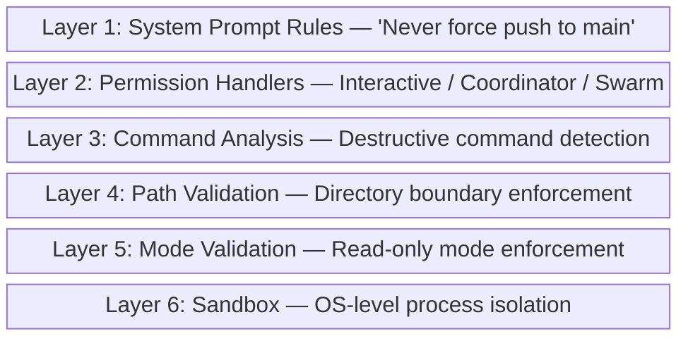

# Tool Security Model

Claude Code implements a multi-layered security system that's significantly more sophisticated than most AI coding tools. Understanding these layers helps you configure permissions effectively and explains why certain operations require explicit approval.

## Security Layers

## Layer 1: Prompt-Level Safety

The system prompt contains explicit safety rules embedded in tool prompts. For example, the Bash tool prompt includes rules like:
- Never use `--no-verify` to skip git hooks
- Never force push to main/master
- Prefer new commits over amending
- Don't commit `.env` or credential files

These are "soft" guardrails - they guide the model's behavior but rely on the model following instructions.

## Layer 2: Permission Handlers

Three distinct permission handlers in `hooks/toolPermission/handlers/`:

| Handler | Context | Behavior |
|:--------|:--------|:---------|
| `interactiveHandler.ts` | Direct CLI use | Prompts user for approval |
| `coordinatorHandler.ts` | Coordinator/autonomous mode | Applies policy rules |
| `swarmWorkerHandler.ts` | Sub-agent execution | Restricted tool subset |

{: .insight }
> Sub-agents running via `AgentTool` use the `swarmWorkerHandler`, which restricts their available tools. This is why an "explore" agent can't edit files - it's not just a prompt instruction, it's enforced at the permission layer.

## Layer 3: Destructive Command Detection

### BashTool Security (`tools/BashTool/`)

The BashTool has the most extensive security of any tool:

| Module | Purpose |
|:-------|:--------|
| `bashSecurity.ts` | Core security analysis of commands |
| `bashPermissions.ts` | Permission rules for bash commands |
| `destructiveCommandWarning.ts` | Warns about destructive operations |
| `commandSemantics.ts` | Understands what commands do |
| `sedValidation.ts` | Detects write operations in sed commands |
| `sedEditParser.ts` | Parses sed commands to understand edits |
| `pathValidation.ts` | Validates file paths are within allowed directories |
| `modeValidation.ts` | Enforces read-only mode restrictions |
| `readOnlyValidation.ts` | Additional read-only checks |
| `shouldUseSandbox.ts` | Decides whether to sandbox a command |

### PowerShellTool Security (`tools/PowerShellTool/`)

PowerShell has its own parallel security system:

| Module | Purpose |
|:-------|:--------|
| `powershellSecurity.ts` | PowerShell-specific command analysis |
| `powershellPermissions.ts` | Permission rules |
| `destructiveCommandWarning.ts` | Destructive operation warnings |
| `gitSafety.ts` | Git-specific safety checks |
| `commandSemantics.ts` | PowerShell command understanding |
| `clmTypes.ts` | Constrained Language Mode types |
| `pathValidation.ts` | Path boundary enforcement |
| `modeValidation.ts` | Mode restriction enforcement |
| `readOnlyValidation.ts` | Read-only mode checks |

{: .insight }
> The `sedEditParser.ts` is a fascinating module - it parses `sed` commands to detect when they would modify files, treating `sed -i` as a write operation even though it's executed through the Bash tool. This prevents bypassing file edit restrictions through shell commands.

## Layer 4: Path Validation

Both BashTool and PowerShellTool include `pathValidation.ts` modules that:
- Verify commands operate within the allowed working directory
- Prevent path traversal attacks
- Enforce directory boundaries for sub-agents

## Layer 5: Mode Validation

The `modeValidation.ts` and `readOnlyValidation.ts` modules enforce operational modes:
- **Read-only mode** - Only reading/searching tools work
- **Plan mode** - Prevents code changes while planning
- **Worktree mode** - Restricts operations to isolated worktree

## Layer 6: Sandbox

The `shouldUseSandbox.ts` module determines when to run commands in an OS-level sandbox:
- Untrusted commands get sandboxed
- File system access is restricted
- Network access may be limited

{: .tip }
> **Practical implication:** If Claude Code asks for permission to run a command, it's because the security system flagged it - not because the model is being cautious. Trust the permission system and review what it's asking to do.

## Cyber Risk Instructions

The `constants/cyberRiskInstruction.ts` module contains specific instructions about cybersecurity risks, ensuring Claude Code doesn't:
- Generate malicious code
- Help with unauthorized access
- Create DoS tools
- Bypass security measures

This is a dedicated module, not just a paragraph in the system prompt - indicating Anthropic takes this seriously enough to maintain it separately.
